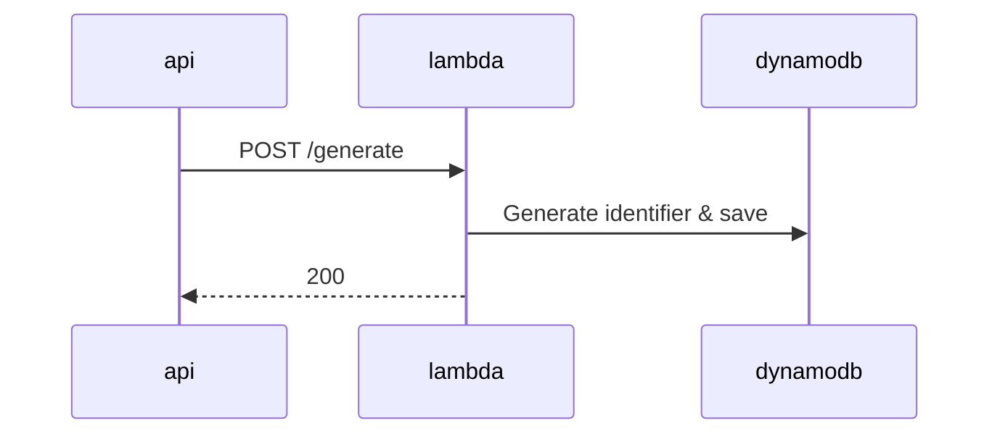
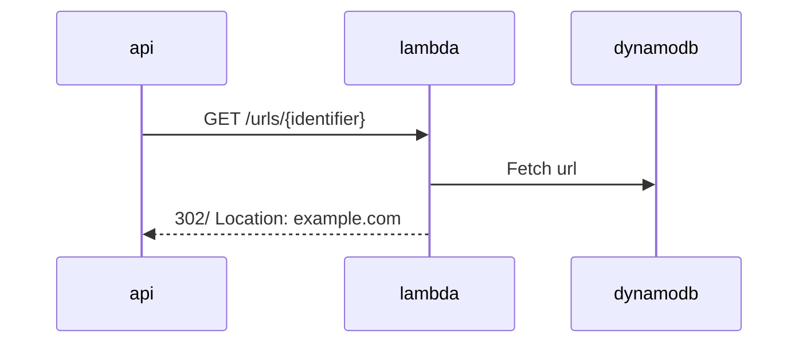

# API

## Description
This is a simple backend implementation built using AWS serverless architecture. It utilizes AWS API Gateway, AWS Lambda, and DynamoDB to generate shortened URLs and redirect users to their original destinations.

The URL shortener consists of two main functionalities:
1. Generating a random identifier for a given link.

2. Retrieving a link given an identifier.

## DNS configuration

API Gateway is deployed in Edge-Optimized mode, which means AWS automatically created a cloudfront distribution for,
which by itself is used as target alias for DNS record on Route 53

## AWS Resources
The following resources are created manually:

* DNS hosted zone
* Certificate
* API Customer domain (in us-east-1)